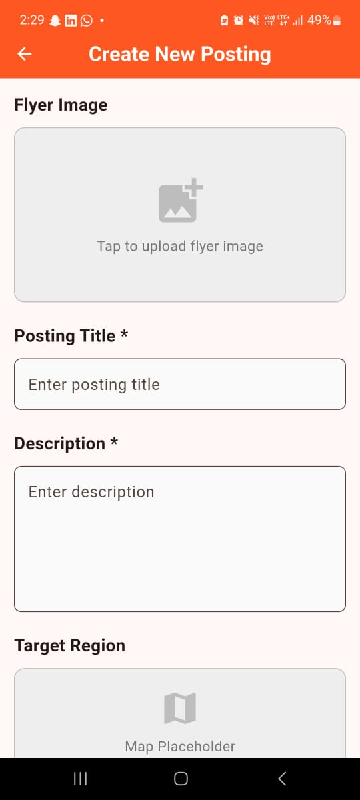
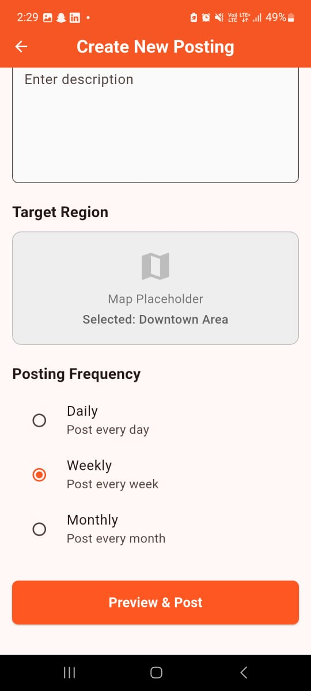
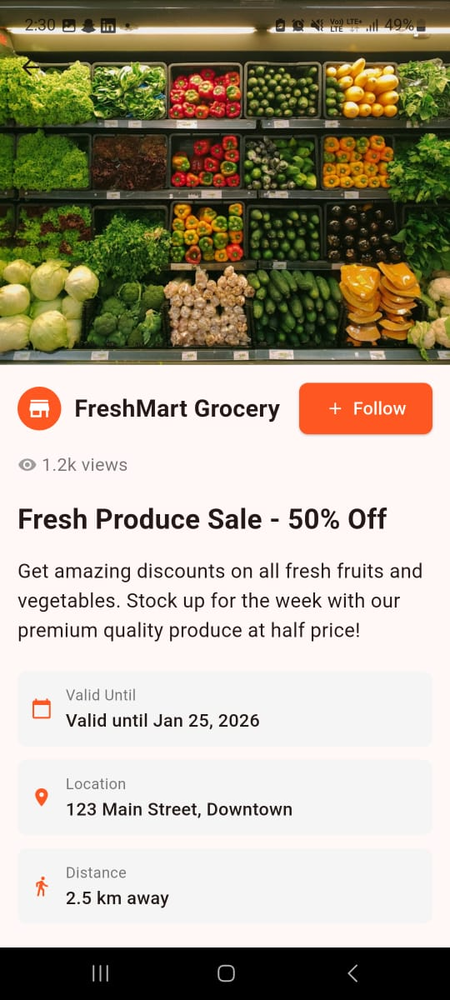

# Flyers Friday 📱

A clean and modern Flutter mobile application for browsing and creating local flyers and promotional deals.

## 🎯 About

Flyers Friday is a mobile-first application designed for users to discover local deals, browse flyers from nearby stores, and create their own promotional postings. This is an assessment project showcasing Flutter UI development and best practices.

## 🛠️ Tech Stack

- **Flutter**: Latest stable version (3.x)
- **Dart**: Programming language
- **Material Design 3**: UI framework
- **State Management**: setState (built-in)
- **Navigation**: Navigator (Flutter's built-in routing)
- **Platform Support**: Android & iOS

### Dependencies

```yaml
dependencies:
  flutter:
    sdk: flutter
  cupertino_icons: ^1.0.8
```

## 📁 Project Structure

```
lib/
├── main.dart                    # App entry point and theme configuration
├── models/
│   └── flyer.dart              # Flyer data model
├── data/
│   └── dummy_data.dart         # Static dummy data for flyers
├── screens/
│   ├── local_flyers_feed_screen.dart    # Home screen with flyer list
│   ├── flyer_details_screen.dart        # Detailed flyer view
│   └── create_posting_screen.dart       # Create new posting form
└── widgets/
    ├── flyer_card.dart         # Reusable flyer card component
    ├── category_chip.dart      # Category filter chip
    └── bottom_nav_bar.dart     # Bottom navigation bar
```

## ✨ Features Completed

### ✅ Screen 1: Local Flyers Feed (Home Screen)
- [x] AppBar with "Flyers Friday" branding
- [x] Search bar UI with search icon
- [x] Category tabs (All, Grocery, Fashion) using FilterChips
- [x] Dynamic flyer list with ListView.builder
- [x] Flyer cards displaying:
  - Network images with error handling
  - Flyer title
  - Store name
  - Distance from user
- [x] Bottom Navigation Bar (Feed, Map, Deals, Profile)
- [x] Navigation to detail screen on card tap
- [x] Floating Action Button for quick posting

### ✅ Screen 2: Flyer Details Screen
- [x] Large expandable image header (SliverAppBar)
- [x] Store name with Follow button (interactive toggle)
- [x] View count display (formatted: 1.2k)
- [x] Full flyer title and description
- [x] Offer validity date
- [x] Location information
- [x] Distance indicator
- [x] Action buttons:
  - Share button with feedback
  - Save/Unsave toggle with visual feedback
  - Get Directions button

### ✅ Screen 3: Create New Posting Screen
- [x] Image upload section (tap to simulate selection)
- [x] Form input fields:
  - Posting Title (TextField)
  - Description (multiline TextField)
- [x] Target region map placeholder
- [x] Posting frequency selector (Radio buttons):
  - Daily
  - Weekly
  - Monthly
- [x] Form validation
- [x] "Preview & Post" button with preview dialog
- [x] Success feedback on completion

### ✅ Additional Features
- [x] Reusable widget components
- [x] Clean folder structure
- [x] Responsive UI with proper spacing
- [x] Material Design 3 theming
- [x] Smooth navigation transitions
- [x] Error handling for images
- [x] User feedback (SnackBars, Dialogs)
- [x] 8 sample flyers with diverse content

## 🚫 Not Completed (Out of Scope)

- [ ] Backend API integration
- [ ] Real authentication system
- [ ] Database persistence
- [ ] Actual image picker functionality
- [ ] Real map integration (Google Maps/Apple Maps)
- [ ] Push notifications
- [ ] Real-time search functionality
- [ ] User profile management
- [ ] Social sharing integration
- [ ] Geolocation services

## 🚀 How to Run the App

### Prerequisites

1. Install [Flutter SDK](https://flutter.dev/docs/get-started/install)
2. Install [Android Studio](https://developer.android.com/studio) (for Android) or [Xcode](https://developer.apple.com/xcode/) (for iOS)
3. Set up an emulator or connect a physical device

### Installation Steps

1. **Clone the repository**
   ```bash
   git clone <your-repo-url>
   cd flyers
   ```

2. **Get dependencies**
   ```bash
   flutter pub get
   ```

3. **Check Flutter setup**
   ```bash
   flutter doctor
   ```

4. **Run the app**
   
   For Android:
   ```bash
   flutter run
   ```
   
   For iOS (macOS only):
   ```bash
   flutter run -d ios
   ```
   
   For web:
   ```bash
   flutter run -d chrome
   ```

5. **Build release version**
   
   Android APK:
   ```bash
   flutter build apk --release
   ```
   
   iOS:
   ```bash
   flutter build ios --release
   ```

## 📸 Screenshots

### 📝 Create New Posting Screen
<table>
  <tr>
    <td></td>
    <td></td>
  </tr>
</table>

### 📰 Flyer Details Screen
<table>
  <tr>
    <td></td>
    <td></td>
  </tr>
</table>


## 🎨 Design Highlights

- **Color Scheme**: Deep Orange primary color for vibrant, engaging UI
- **Typography**: Material Design 3 type scale
- **Spacing**: Consistent 8px grid system
- **Components**: Rounded corners (12px radius) for modern look
- **Elevation**: Subtle shadows for depth
- **Interactions**: Visual feedback for all user actions

## 📝 Code Quality

- Clean, readable code with proper naming conventions
- Reusable widget components
- Separation of concerns (models, screens, widgets, data)
- Proper error handling
- Beginner-friendly structure
- Comments for clarity

## 🎓 Assessment Context

This project was created as part of a Flutter development assessment to demonstrate:
- Flutter UI development skills
- Material Design implementation
- Component-based architecture
- State management
- Navigation patterns
- Code organization and best practices

## 👨‍💻 Developer

Created for Flutter assessment - January 2026

## 📄 License

This project is created for assessment purposes.

---

**Note**: This is a UI-focused demonstration app using static dummy data. No real API calls or backend services are implemented.
